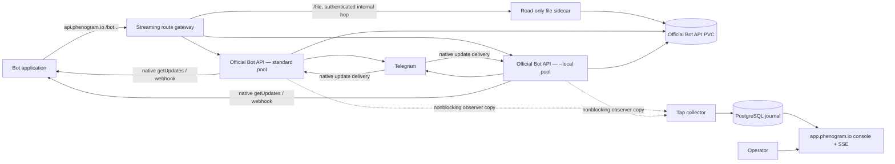

# Phenogram Platform

Phenogram is a Telegram Bot API gateway and operator console. Bot applications keep the standard Telegram Bot API URL shape, while the production data plane delegates the complete Bot API contract to a pinned build of Telegram's official [`tdlib/telegram-bot-api`](https://github.com/tdlib/telegram-bot-api). Phenogram adds bot ownership, managed-bot hierarchy, an observable update journal, a live console, and operator replies without putting those features in the native polling or webhook delivery path.

## What is included

- Streaming `/bot<token>/<method>` gateway to the official Bot API server, including JSON, forms, multipart uploads, long polling, webhooks, production DC, and test DC paths.
- Streaming `/file/bot<token>/<file_path>` downloads from official Bot API storage, including `GET`, `HEAD`, and byte ranges.
- Ownership verification through Telegram `getMe` and readable Telegram authentication errors.
- Google and GitHub sign-in by stable provider identity, without requesting, receiving, or storing email addresses or provider tokens.
- Encrypted bot credentials and lifecycle webhook secrets in the Phenogram PostgreSQL control plane.
- Automatic Telegram managed-bot discovery and a visible parent/child hierarchy.
- Searchable update and API activity history, live SSE updates, conversation projections, and operator text replies from Bot View.
- Free, Pro, and Scale plan definitions, bot coverage, and retention warnings.
- Separate standard and Telegram `--local` official-server pools.
- Direct production deployment to Contabo from `master` with GitHub Actions, Helm, and `kubectl`.

## Production architecture



The gateway derives a keyed lookup ID from the presented token, resolves it in a last-good in-memory route snapshot, and selects the `standard` or `local` pool. It does not query PostgreSQL, parse Bot API bodies, buffer uploads, or retry request bodies on the request path. Request and response bodies stream directly to the official server.

The official server owns `getUpdates`, `setWebhook`, `deleteWebhook`, `getWebhookInfo`, update acknowledgement, webhook retries, and every other Bot API method. Phenogram does not virtualize those methods. Standard-pool compatibility therefore tracks the pinned official server rather than a separately reimplemented subset.

Telegram's official server does not expose a public HTTP `/file` endpoint. Each pool therefore has a small authenticated file sidecar that reads the same Bot API PVC read-only. The public gateway streams file responses from that sidecar and never exposes its internal bearer credential.

## Native delivery and the observer journal

The update tap is deliberately outside the native delivery contract. After the official server has accepted an update into its `TQueue` and scheduled the native long-poll or webhook wakeup, it attempts a nonblocking Unix datagram copy to the collector. There is no database call, wait, retry, or bot token in this ordinary type-1 update path.

If the collector, socket, or PostgreSQL is unavailable or overloaded, that type-1 observer copy may be dropped permanently. The update can therefore be delivered correctly through native `getUpdates` or a native webhook while being absent from Phenogram's journal, conversations, and SSE stream. This isolation is intentional: storage and UI failures must not slow down, reject, or destabilize Telegram delivery.

Once an observer copy is committed, PostgreSQL is the replay source for the console and public SSE stream. PostgreSQL `NOTIFY` wakes live listeners across application processes; reconnects use stored rows and `Last-Event-ID`. The journal is durable for copies that reached PostgreSQL, not a guaranteed complete replica of Telegram's native queue.

Create a revocable stream URL in **Delivery & API**, then consume it as a bearer URL:

```sh
curl -N "$PHENOGRAM_STREAM_URL"
```

Events are named `update` and use the journal row ID as the SSE ID. Reconnect with `Last-Event-ID` or `?after=<row_id>`. A replay page is capped at 5,000 rows, 8 MiB serialized total, and roughly 2 MiB for one event; a `resync` event tells the client to reconnect from the supplied ID. Stream-key secrets are stored only as hashes and are rechecked approximately every 15 seconds.

## Public hosts

Production deliberately separates three origins:

- `https://phenogram.io` — public landing page and privacy policy;
- `https://app.phenogram.io` — authenticated console and management `/api/*`;
- `https://api.phenogram.io` — token-bearing Bot API/file paths, SSE, and signed public downloads.

All three terminate directly at ingress-nginx on Contabo. Their Cloudflare records are DNS-only. The machine API ingress disables access logs and discards its nginx error log because Telegram puts bot tokens in request paths.

## Point a bot application at Phenogram

Connect the bot in the console, then replace only the API host:

```text
Official:   https://api.telegram.org/bot${BOT_TOKEN}/${METHOD}
Phenogram:  https://api.phenogram.io/bot${BOT_TOKEN}/${METHOD}
```

For example:

```sh
curl "https://api.phenogram.io/bot${BOT_TOKEN}/getMe"
```

Files use the matching Telegram path:

```text
https://api.phenogram.io/file/bot${BOT_TOKEN}/${FILE_PATH}
```

Production and test-DC bots are separate identities. Select the environment when connecting; test requests keep Telegram's native `/bot<token>/test/<method>` and `/file/bot<token>/test/<file_path>` forms.

Treat every complete Bot API or file URL as a credential. The chart redacts the machine host at ingress, but any CDN, load balancer, APM agent, or downstream log collector must do the same.

## Connecting an existing bot

Phenogram verifies the token with `getMe` and inspects the current native webhook before changing the bot's Telegram session. When a webhook exists, the console explains that it will be transferred automatically. Telegram's `getWebhookInfo` does not return the current `secret_token`, uploaded certificate, or the original pinned `ip_address`; the user must provide the current secret or explicitly confirm that no secret is used before Phenogram mutates the session. Recoverable webhook settings are then restored on the target official pool.

When `getWebhookInfo` reports a current IPv4 address, Phenogram stops before mutation because Telegram does not distinguish a configured pin from a DNS-derived address. The console asks whether to preserve that exact IPv4 address or continue resolving the webhook hostname through DNS. `webhook_ip_address_preserved: true` means the user explicitly selected fixed-IP continuity. Webhooks using uploaded custom certificates remain blocked before mutation because Telegram does not return the certificate bytes required for a compatible replay.

The token remains in the form after a failed connection attempt, and Telegram authentication failures are translated into a readable invalid/revoked-token error.

## Bot View and management API

The console provides update search, live updates without manual refresh, recent API activity, conversation projections, incoming/outgoing timelines, operator `sendMessage` replies, stream-key management, signed public file links, and bot-family grouping.

Its JSON API lives under `/api` on `app.phenogram.io`:

| Area | Routes |
| --- | --- |
| Public | `GET /api/health`, `GET /api/plans`, `GET /api/auth/oauth/{google\|github}/start`, `GET /api/auth/oauth/{google\|github}/callback` |
| Session | `POST /api/auth/logout`, `GET /api/me` |
| Bots | `GET/POST /api/bots`, `GET/DELETE /api/bots/{bot_id}`, `POST /api/bots/{bot_id}/provision`, `POST /api/bots/{bot_id}/managed-webhook-recovery` |
| Journal | `GET /api/bots/{bot_id}/updates`, `GET /api/bots/{bot_id}/updates/stream`, `GET /api/bots/{bot_id}/activity` |
| Bot View | `GET /api/bots/{bot_id}/conversations`, `GET /api/bots/{bot_id}/conversations/{chat_id}/messages`, `POST /api/bots/{bot_id}/messages` |
| Delivery | `GET/POST /api/bots/{bot_id}/stream-keys`, `DELETE /api/bots/{bot_id}/stream-keys/{key_id}`, `POST /api/bots/{bot_id}/file-links` |

The OAuth callback establishes an HTTP-only session. Every mutating management request requires that cookie, an exact-origin check, and `X-Phenogram-CSRF`.

Google requests only `openid profile`. GitHub requests no OAuth scope and fetches only the stable public identity fields required by the console. Phenogram does not request an email scope or field, call GitHub's email endpoint, or persist provider access/refresh tokens.

## Managed bot families

When a connected manager creates or changes a managed bot, the official patch appends a separate token-free lifecycle record to a reserved persistent observer queue after native Telegram handling. The collector commits an idempotent receipt and synchronization job together, then returns an exact ACK. Phenogram fetches the child token with Telegram's [`getManagedBotToken`](https://core.telegram.org/bots/api#getmanagedbottoken), verifies it with `getMe`, encrypts the control-plane copy, places the child in the manager's current pool, and shows it beneath its manager. There is no opt-in switch.

If a manager is disconnected, its children remain visible in a manager-missing group. Reconnecting the same Telegram manager restores the hierarchy. Discovery is not rejected at a subscription bot limit.

Lifecycle records replay after lost datagrams, lost ACKs, collector restarts, and temporary PostgreSQL outages. This queue is deliberately bounded to 10,000 records with seven-day expiry: overflow, expiry, or native persistence failure is counted and fails open rather than affecting Telegram delivery. Ordinary journal updates remain the separate best-effort type-1 path.

A managed token rotation is automatic when the child's native mode is polling. If the child has an active native webhook, Phenogram stops before withdrawing its current route or changing the official session. The console then asks for the existing secret token or explicit confirmation that none is used, plus an explicit fixed-IP-or-DNS choice when Telegram reports a current IPv4 address, and refetches the replacement managed token before continuing the durable rotation. The secret remains in request memory until the encrypted lifecycle operation is created; it is never written to job status or audit metadata. Uploaded custom certificates remain a pre-mutation stop until the receiver is changed to a publicly trusted certificate because Telegram does not expose the certificate bytes.

## Plans and retention

| Plan | Covered bots | Covered bot data retention | Local Bot API access | Seeded monthly price |
| --- | ---: | ---: | --- | ---: |
| Free | 1 | 30 days | No | $0 |
| Pro | 5 | 90 days | Yes | $29 |
| Scale | 25 | 365 days | Yes | $99 |

New social identities receive Free membership. Directly connected bots consume covered capacity first. Managed bots on Free, managed bots above a paid plan's covered capacity, and children without a connected manager keep only one day of Phenogram observer data. The console shows total and covered bot counts and highlights every bot whose copied updates will expire after 24 hours.

Retention applies to journal rows, outbound messages, API activity, conversation projections, and bot-scoped audit records. It never deletes or acknowledges updates in the official server's native queue.

Checkout and self-service plan changes are not implemented; seeded plans are assigned administratively.

## Standard and local pools

The `standard` pool runs the pinned official server without `--local` and is the compatibility target for normal public Telegram Bot API clients. The `local` pool runs the same binary with Telegram's `--local` option and is available only to eligible plans.

`--local` keeps Telegram's server-local file semantics. An absolute `file_path` refers to a path on the Contabo Bot API PVC; it is not a path on the developer's laptop or bot-application host. The authenticated read-only file sidecar serves that exact native path. Pool placement is selected when a bot is connected; moving an already active bot between pools is not currently exposed as an ordinary routing toggle.

## Storage and security boundary

Phenogram has two deliberately different credential stores:

- The application stores bot tokens and webhook/lifecycle secrets encrypted in PostgreSQL with XChaCha20-Poly1305 and per-record associated data. It needs the decrypted token for control-plane calls such as Bot View replies and managed-bot synchronization.
- The official Bot API StatefulSets use upstream storage unchanged. Their PVC directories and persisted state may contain the complete raw bot token, including `<raw-token>/` and test-DC `<raw-token>:T/` directory names. Phenogram adds no official-storage encryption, wrapper, KDF, or `database_encryption_key`.

Consequently, access to a data-plane node, official-server PVC, filesystem snapshot, or volume backup must be treated as access to every token stored there. `MASTER_KEY` protects only the application database copy; it does not protect or unlock official Bot API storage.

The public gateway keeps only keyed token lookup hashes in its last-good route snapshot. The observer tap contains numeric bot identity and update data, never a token. Those facts reduce accidental exposure but do not make the token-bearing public path or native PVC non-sensitive.

## Local development

The base Compose stack remains useful for control-plane and UI development:

```sh
cp .env.example .env
docker compose up --build -d
curl -fsS http://app.localhost/api/health
```

Configure independent `MASTER_KEY`, `PUBLIC_ID_KEY`, and `LINK_SIGNING_KEY` values of at least 32 bytes, a non-default PostgreSQL password, and separate development OAuth clients. Open `http://localhost` for the landing page and `http://app.localhost` for the console.

The base Compose topology is not the production native data plane and is not evidence of full gateway compatibility. Production validation uses the Helm-deployed gateway, both pinned official pools, collector, and file sidecars on Contabo.

## Production deployment

Every push to `master` runs validation, builds immutable application, official-server, and gateway images, and deploys the chart directly to the `phenogram` namespace on Contabo with Helm and the namespace-scoped `KUBECONFIG`. The workflow reconciles `DATA_PLANE_SYNC_TOKEN` directly into the existing Kubernetes Secret. It does not put the secret in Helm values or release history.

Phenogram does not use Flux for application deployment, and this repository must not add project releases to `infra-flux`. See the [production chart guide](deploy/helm/phenogram-platform/README.md) and [operations guide](docs/operations.md).

The first official-data-plane cutover is intentionally destructive for legacy bot state: build and deploy the new resources in shadow, delete the disposable legacy bot record/session data rather than migrating it, then switch `/bot*` and `/file*` publicly and remove the obsolete legacy PVC after validation. User identities and browser sessions are control-plane data and are not part of that bot-data deletion.

## License

Phenogram Platform is free software licensed under the [GNU Affero General Public License v3.0 or later](LICENSE).
