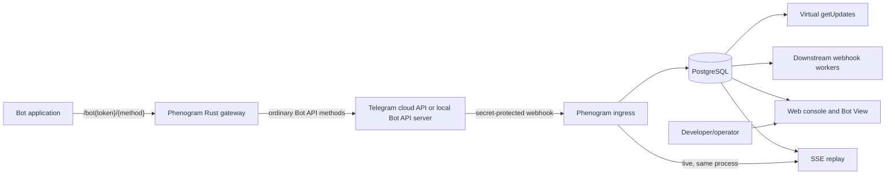

# Phenogram Platform

Phenogram is a Rust gateway and operator console for Telegram bots. A bot keeps using the familiar Telegram Bot API path shape, while Phenogram records incoming updates, exposes a searchable history, supports managed polling and downstream webhooks, provides a replayable SSE stream, and lets an operator inspect conversations and reply as the bot.

This repository is a production-oriented MVP, not a claim of complete Telegram Bot API equivalence or a finished billing product. The implemented scope and current limits are called out below and in [the operations guide](docs/operations.md).

## What is included

- A pass-through Bot API and file gateway for connected bots.
- Ownership verification with the bot token via Telegram `getMe`.
- Encrypted bot, ingress, and downstream webhook secrets in PostgreSQL.
- Durable, deduplicated update capture with plan-based expiry.
- Virtual `getUpdates`, `setWebhook`, `deleteWebhook`, and `getWebhookInfo` methods backed by Phenogram's update journal.
- Revocable SSE stream URLs whose secret is stored only as a hash.
- Expiring, signed public file links that do not expose the bot token, including opaque local-server file references.
- A responsive web console for update inspection, API activity, conversations, text replies, stream-key management, signed file links, and premium routing.
- Free, Pro, and Scale plan definitions, bot limits, and retention periods.
- Optional routing to a separately operated official local Telegram Bot API server for eligible plans.

## Architecture



At startup the application runs SQL migrations, starts one retention task and four downstream webhook workers, then serves the API and embedded web UI. PostgreSQL is the system of record. The live SSE broadcast is in-process; PostgreSQL supplies reconnect replay.

## Quick start

Requirements:

- Docker with Compose
- outbound access to Telegram
- a bot token from [@BotFather](https://t.me/BotFather)

Create local configuration and replace all three placeholder application keys with independent random values:

```sh
cp .env.example .env
openssl rand -base64 48
openssl rand -base64 48
openssl rand -base64 48
```

Put those values in `MASTER_KEY`, `PUBLIC_ID_KEY`, and `LINK_SIGNING_KEY`, set a non-default `POSTGRES_PASSWORD`, then start the stack:

```sh
docker compose up --build -d
curl -fsS http://localhost:8080/api/health
```

Open `http://localhost:8080`, create an account, and connect the bot token. Phenogram verifies `getMe`, checks for an existing Telegram webhook, encrypts the credential, and asks Telegram to deliver updates to Phenogram.

For a real bot, `PUBLIC_BASE_URL` must be a publicly reachable HTTPS origin before the bot is connected. Telegram cannot deliver updates to the default `localhost` URL; in that case the bot may be saved with a `degraded` status. Production configuration also refuses a non-HTTPS public URL.

## Management API

The web console uses the JSON API under `/api`; no separate OpenAPI document is generated in this MVP.

| Area | Routes |
| --- | --- |
| Public | `GET /api/health`, `GET /api/plans`, `POST /api/auth/register`, `POST /api/auth/login` |
| Session | `POST /api/auth/logout`, `GET /api/me` |
| Bots | `GET/POST /api/bots`, `GET/DELETE /api/bots/{bot_id}`, `POST /api/bots/{bot_id}/provision` |
| Journal | `GET /api/bots/{bot_id}/updates`, `GET /api/bots/{bot_id}/activity` |
| Bot View | `GET /api/bots/{bot_id}/conversations`, `GET /api/bots/{bot_id}/conversations/{chat_id}/messages`, `POST /api/bots/{bot_id}/messages` |
| Delivery | `GET/POST /api/bots/{bot_id}/stream-keys`, `DELETE /api/bots/{bot_id}/stream-keys/{key_id}`, `POST /api/bots/{bot_id}/file-links`, `POST /api/bots/{bot_id}/routing` |

Registration/login set an HTTP-only session cookie and return a CSRF token. Every other mutating management request requires that cookie plus `X-Phenogram-CSRF`. In production, all management mutations—including registration and login—also require an `Origin` equal to `PUBLIC_BASE_URL`; configure the base URL without a trailing slash.

## Point a bot at Phenogram

After the token has been connected in the console, change only the API host used by the bot application:

```text
Official:   https://api.telegram.org/bot${BOT_TOKEN}/${METHOD}
Phenogram:  https://api.phenogram.io/bot${BOT_TOKEN}/${METHOD}
```

For example:

```sh
curl "https://api.phenogram.io/bot${BOT_TOKEN}/getMe"
```

Telegram file downloads use the corresponding compatible path:

```text
https://api.phenogram.io/file/bot${BOT_TOKEN}/${FILE_PATH}
```

Keep the token in a server-side secret. Telegram's API format places it in the URL; the supplied Caddy configuration therefore replaces the full request URI in access logs. Apply equivalent redaction in every load balancer, CDN, APM agent, and log collector in front of the application.

Most methods are streamed to the selected Telegram backend. Four update-management methods are implemented by Phenogram:

| Method | MVP behavior |
| --- | --- |
| `getUpdates` | Reads retained updates from PostgreSQL. Supports `offset`, `limit`, `timeout` (capped at 50 seconds), negative offsets, and `allowed_updates`. |
| `setWebhook` | Stores a downstream webhook URL and optional secret, switches the bot to webhook mode, and queues retained unconfirmed updates unless `drop_pending_updates` is true. |
| `deleteWebhook` | Removes the downstream destination and returns the bot to managed polling. It does not remove Telegram's upstream webhook to Phenogram. |
| `getWebhookInfo` | Reports the downstream Phenogram queue and last recorded delivery error. It is not the status of Telegram's upstream webhook. |

Managed update methods accept JSON, form data, or query parameters. Multipart bodies, custom webhook certificates, and `ip_address` behavior are not implemented. `max_connections` is stored and reported, but delivery concurrency is currently four workers per application process rather than a per-bot concurrency controller.

See the [Telegram Bot API documentation](https://core.telegram.org/bots/api) for the upstream API contract.

## Update subscriptions

### Managed polling

Calling `getUpdates` through Phenogram reads the saved journal rather than polling Telegram. A positive `offset` confirms earlier update IDs for subsequent reads. Long polling waits for an in-process update notification and then re-queries PostgreSQL.

### Managed downstream webhook

A bot application's normal `setWebhook` call through the Phenogram base URL configures its downstream URL. Telegram still sends the upstream update to Phenogram; Phenogram commits it first, then delivers it from a durable queue. Production destinations must be HTTPS, resolve only to public addresses, and use one of Telegram's standard webhook ports. Failed deliveries retry with exponential delays capped at one hour and disappear when their retained update expires.

Phenogram forwards `X-Telegram-Bot-Api-Secret-Token` when a downstream secret was supplied. A successful downstream JSON response containing a Bot API `method` is also executed, matching Telegram's webhook-response pattern.

### Server-Sent Events

Create a stream URL from **Delivery & API** in the console, then consume it as a secret bearer URL:

```sh
curl -N "$PHENOGRAM_STREAM_URL"
```

Events are named `update` and use the database row ID as the SSE event ID. Reconnect with `Last-Event-ID` or `?after=<row_id>`. One connection replays at most 5,000 rows, 8 MiB of serialized data, and roughly 2 MiB per event before live delivery. If a row or byte limit is reached, Phenogram emits `resync`; reconnect from that event ID to continue:

```sh
curl -N -H "Last-Event-ID: 1234" "$PHENOGRAM_STREAM_URL"
```

The URL is shown once. Its secret is hashed in the database and can be revoked independently of the Telegram token; connected streams recheck revocation about every 15 seconds. Each application process permits 256 concurrent SSE connections globally and four per stream key. Treat the complete URL as a credential and redact it from logs. WebSockets, Kafka, and other transports are intentionally not part of this MVP.

## Signed public files

After Telegram `getFile` returns a `file_path`, an authenticated operator can create and copy a public download URL in the console. The URL contains a bot public ID, path, expiry, and HMAC signature—not the bot token. TTL is clamped to 60 seconds through seven days, and the response is streamed rather than cached by Phenogram. Range requests are forwarded to Telegram or served locally with `206 Partial Content`.

Anyone with the complete URL can use it until expiry; there is no per-link revocation list. Rotate `LINK_SIGNING_KEY` to invalidate all outstanding links. In premium local mode, Phenogram replaces an absolute local-server path with an authenticated-encrypted opaque reference. Downloads are allowed only when the decrypted canonical path remains under the configured read-only `TELEGRAM_LOCAL_DATA_DIR`.

## Bot View and observability

The console provides:

- update search by type, payload text, chat, and cursor;
- the latest 200 recorded API calls;
- conversation projections from incoming updates;
- a merged incoming/outgoing conversation timeline;
- operator text replies through `sendMessage`;
- named stream-key creation, inventory, refresh, and revocation;
- signed file-link creation;
- confirmed cloud/local routing migration for eligible plans.

Outgoing timeline capture is limited to `sendMessage` requests that Phenogram can safely inspect, plus replies sent from Bot View. It is not a complete audit of every media or multipart call.

## Plans and retention

| Plan | Bots | Bot data retention | Local Bot API routing | Seeded monthly price |
| --- | ---: | ---: | --- | ---: |
| Free | 1 | 30 days | No | $0 |
| Pro | 5 | 90 days | Yes | $29 |
| Scale | 25 | 365 days | Yes | $99 |

New accounts receive Free membership. Limits are enforced in the API and again by a database trigger. Plan retention is stamped onto updates, outbound messages, API calls, conversation projections, and bot-scoped audit records when they are created or refreshed; a later plan change does not recalculate existing expiry timestamps. Account-scoped audit records expire after one year, sessions use their own TTL, and webhook delivery rows disappear with their parent updates. Each sweep repeatedly drains every expired table in 5,000-row batches.

Checkout, invoicing, provider webhooks, self-service upgrades, and automated downgrade handling are not implemented; plans are assigned administratively. The plan-selection UI is informational and never changes membership by itself.

## Premium local Telegram Bot API routing

Pro and Scale membership enables the routing control, but the Rust application is not a Telegram server. It targets a separately operated instance of Telegram's [official Bot API server](https://github.com/tdlib/telegram-bot-api). The optional `compose.premium.yaml` overlay builds a pinned upstream revision and runs it as a companion service with a persistent volume. It requires operator-owned `TELEGRAM_API_ID` and `TELEGRAM_API_HASH`; see Telegram's [local server documentation](https://core.telegram.org/bots/api#using-a-local-bot-api-server).

```sh
docker compose -f compose.yaml -f compose.premium.yaml up --build -d
```

Routing migration is explicitly confirmed, serialized per bot, and invokes Telegram `logOut`. Phenogram then installs its managed ingress webhook on the target backend and records a healthy/degraded result; failed provisioning can be retried through the management API. The overlay mounts local Bot API storage read-only into the application for opaque, range-capable file delivery. The application does not monitor or back up the companion service or its volume. Detailed migration cautions are in [docs/operations.md](docs/operations.md).

## Security model

- Passwords are hashed with Argon2; session secrets and SSE secrets are stored as SHA-256 digests.
- Bot tokens and webhook secrets use XChaCha20-Poly1305 with per-record associated data.
- Bot public IDs are keyed, stable pseudonyms; they are identifiers, not authorization.
- Session cookies are `HttpOnly` and `SameSite=Strict`, with `Secure` enabled for production/HTTPS.
- Mutating management requests require an exact-origin check plus `X-Phenogram-CSRF`.
- Registration/login use per-process limits of 30 attempts per source and eight per source/email over ten minutes, with four concurrent Argon2 jobs.
- Upstream ingress requires Telegram's secret-token header and update IDs are deduplicated per bot.
- Downstream webhook delivery disables inherited proxies, rejects non-global production addresses, resolves once per attempt, and pins the request to the validated addresses. Keep infrastructure egress policy as an additional control.
- Existing Telegram webhook URLs are used only to request explicit takeover confirmation; they are not persisted. Audit metadata stores only whether a migration occurred.
- The bundled runtime image runs as an unprivileged user. Caddy terminates TLS, adds security headers, and redacts credential-bearing request fields.

The update journal and conversation data are plaintext application data inside PostgreSQL, so disk encryption, access control, network isolation, backups, deletion policy, and applicable privacy obligations remain deployment responsibilities. Authentication and SSE limits are process-local; the authentication source limiter also trusts forwarding headers supplied by the ingress. Multi-replica deployments need distributed/edge enforcement. There is no built-in MFA, email verification, password reset, WAF, or organization/RBAC model in this MVP.

## Production handoff

Read [docs/operations.md](docs/operations.md) before exposing the service. It covers configuration, TLS topology, readiness, monitoring, backup and restore drills, secret rotation constraints, local routing, and incident runbooks.
